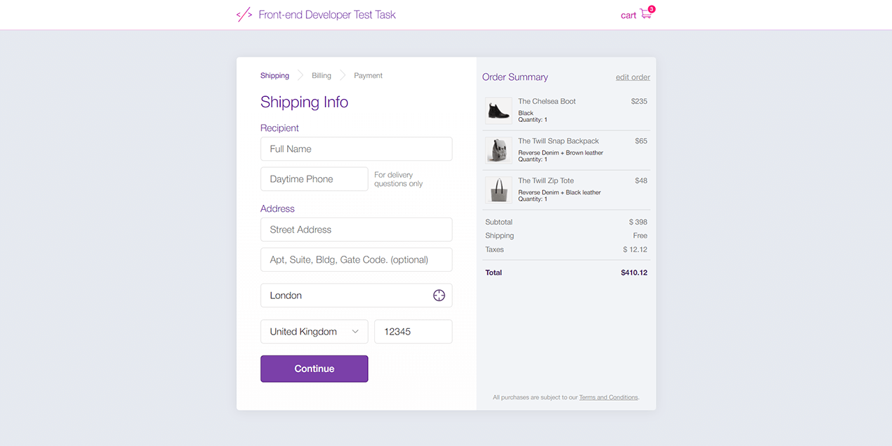

# React Order Form Task
**A sample frontend project on React-TypeScript-SCSS**



A sample order form application imitating the ordering process at an online store.

* Current live version at [https://cat-street.github.io/flatstack-orderform](https://cat-street.github.io/flatstack-orderform)

---

## Usage
* Installing dependencies:
```
npm install
```
* Run in development mode:
```
npm start
```

## Features

* A multi-step ordering form
* Uses fields and form validation
* Each next step is available after previous step successful validation
* Custom error messages appear on field blur or on submitting attempt
* A custom country select input based on a list of countries with filtering capability
* Prompts to detect a user location at loading
* Fetches an address from an external API using detected coordinates (if detecting is allowed)
* Fills a country, a city and a post code fields if address is detected
* Formats entered card number and expiration date
* Detects Visa cards
* Allows to print a printer-optimized order summary at the final stage

## Technology

* React (functional components, hooks, Context, views/logic separation)
* Formik + Yup validation
* TypeScript
* JavaScript (ES6)
* SASS, CSS Modules
* Adaptive layout, semantic HTML
* BEM model
* Geolocation API
* [LocationIQ](https://locationiq.com/) API for address fetching
* Airbnb-typescript ESLint codestyle

## Possible improvements
* Automated testing
* Card system detection and validation
* Card input formatting algorithm improvement
* Using state manager for entered data
* Using routes for form steps
